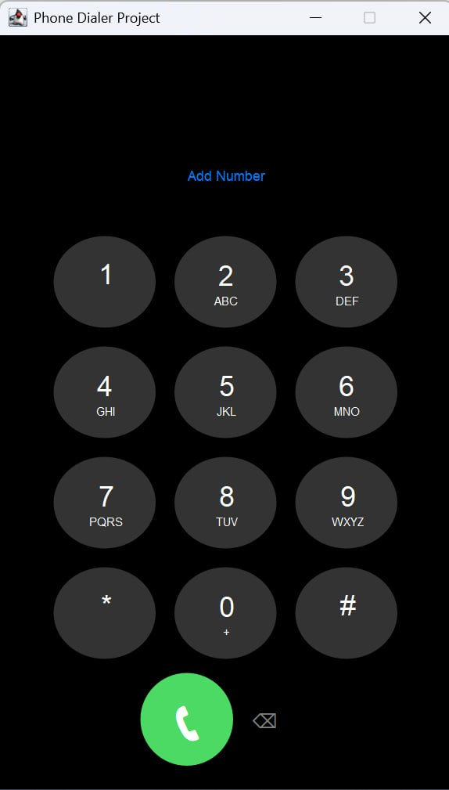
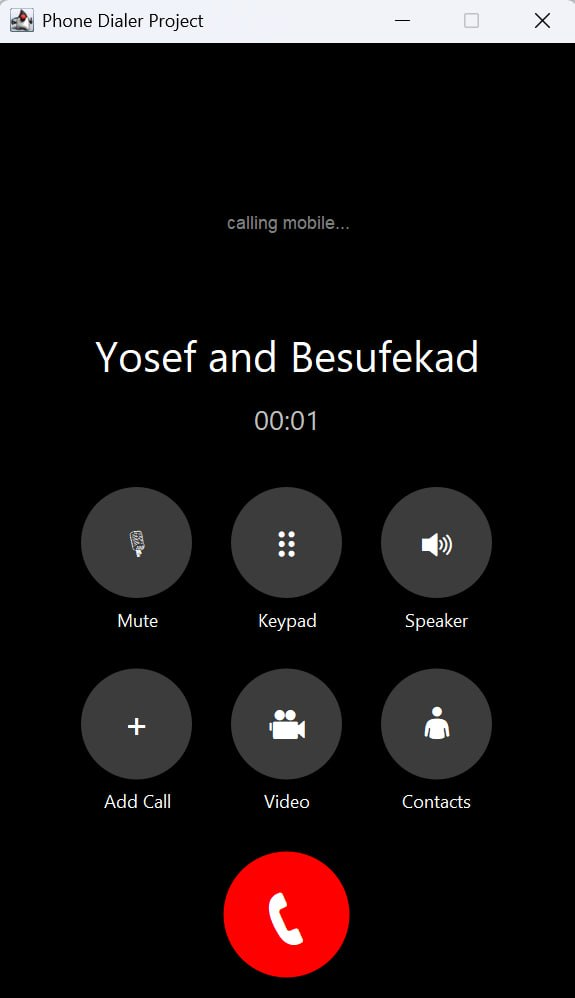

# Java Telephone App Assignment

A Java Swing GUI desktop application built with Maven that simulates a telephone keypad interface.

## Screenshots

<p align="center">
  
  
</p>

## Features

* **Interactive Keypad:** Standard 12-key telephone dial pad (`0-9`, `*`, `#`).
* **Display Field:** Shows the currently entered phone number.
* **Control Buttons:**
  * **Call:** Simulates placing a call (disabled when the display is empty).
  * **Back:** Deletes the last entered digit.
  * **Clear:** Resets the entire display.

## Requirements

* **Java Development Kit (JDK):** Version 25 or higher
* **Apache Maven**

## How to Build and Run

### Using Command Line

1. **Clone the repository:**
   ```bash
   git clone [https://github.com/JosefTewodros12/phone-dialer.git](https://github.com/JosefTewodros12/phone-dialer.git)
   cd phone-dialer
